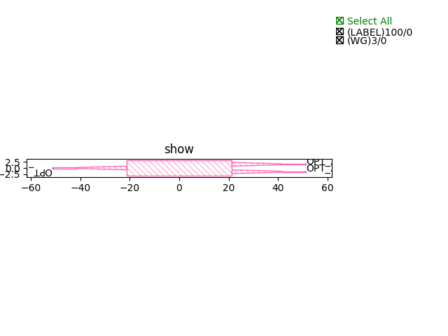
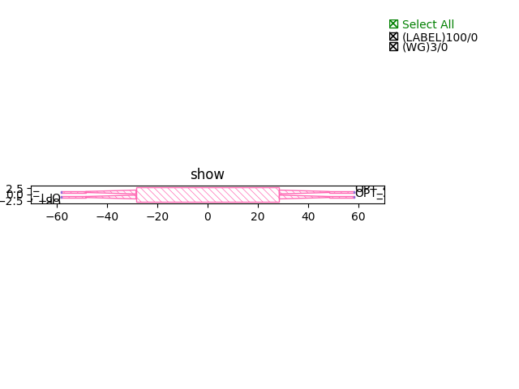
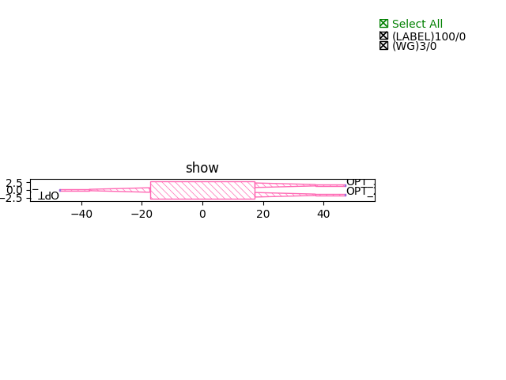
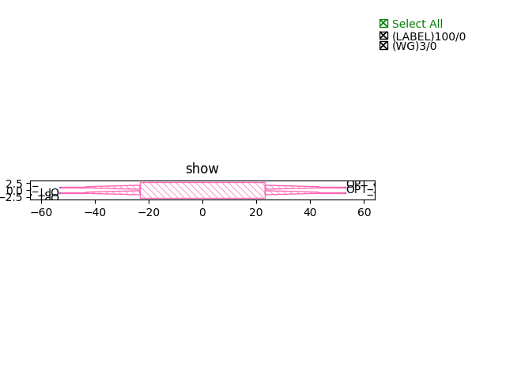

MultiMode Interferometers (MMI)
####################################

SOI340nm_1310nm_TE_STRIP_2x1_MMI
**************************************************

+------------------------------+-----------------------------+-------------+
|          ports               |     waveguide type          | orientation |
+==============================+=============================+=============+
|OPT1                          |  TECH.WG.SOI_STRIP.O.WIRE   |     180     |
+------------------------------+-----------------------------+-------------+
|OPT2                          |  TECH.WG.SOI_STRIP.O.WIRE   |       0     |
+------------------------------+-----------------------------+-------------+
|OPT3                          |  TECH.WG.SOI_STRIP.O.WIRE   |       0     |
+------------------------------+-----------------------------+-------------+

SOI340nm_1310nm_TE_STRIP_2x2_MMI
***************************************************

+----------------------------------+-----------------------------+-------------+
|              ports               |     waveguide type          | orientation |
+==================================+=============================+=============+
|OPT_1                             |  TECH.WG.SOI_STRIP.O.WIRE   |     180     |
+----------------------------------+-----------------------------+-------------+
|OPT_2                             |  TECH.WG.SOI_STRIP.O.WIRE   |     180     |
+----------------------------------+-----------------------------+-------------+
|OPT_3                             |  TECH.WG.SOI_STRIP.O.WIRE   |     0       |
+----------------------------------+-----------------------------+-------------+
|OPT_4                             |  TECH.WG.SOI_STRIP.O.WIRE   |     0       |
+----------------------------------+-----------------------------+-------------+

SOI340nm_1550nm_TE_STRIP_2x1_MMI
***************************************************

+------------------------------+-----------------------------+-------------+
|         ports                |     waveguide type          | orientation |
+==============================+=============================+=============+
|OPT_1                         |  TECH.WG.SOI_STRIP.C.WIRE   |     180     |
+------------------------------+-----------------------------+-------------+
|OPT_2                         |  TECH.WG.SOI_STRIP.C.WIRE   |       0     |
+------------------------------+-----------------------------+-------------+
|OPT_3                         |  TECH.WG.SOI_STRIP.C.WIRE   |       0     |
+------------------------------+-----------------------------+-------------+

SOI340nm_1550nm_TE_STRIP_2x2_MMI
***************************************************

+----------------------------------+-----------------------------+-------------+
|             ports                |     waveguide type          | orientation |
+==================================+=============================+=============+
|OPT_1                             |  TECH.WG.SOI_STRIP.C.WIRE   |     180     |
+----------------------------------+-----------------------------+-------------+
|OPT_2                             |  TECH.WG.SOI_STRIP.C.WIRE   |     180     |
+----------------------------------+-----------------------------+-------------+
|OPT_3                             |  TECH.WG.SOI_STRIP.C.WIRE   |     0       |
+----------------------------------+-----------------------------+-------------+
|OPT_4                             |  TECH.WG.SOI_STRIP.C.WIRE   |     0       |
+----------------------------------+-----------------------------+-------------+
