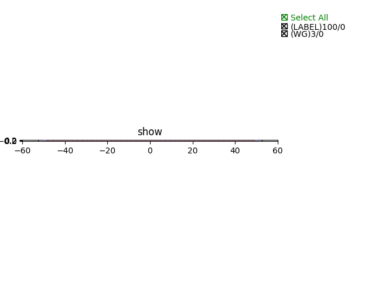
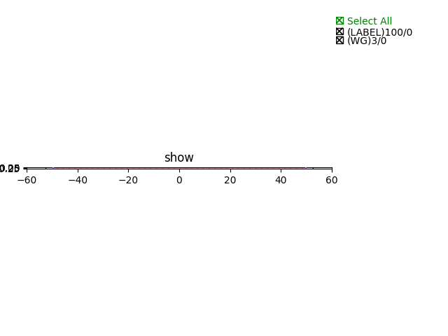

Waveguide
#############################

SOI340nm_1310nm_TE_STRIP_Waveguide
**********************************************************

+-------------------+-----------------------------+-------------+
|     ports         |     waveguide type          | orientation |
+===================+=============================+=============+
|     op_0          |  TECH.WG.SOI_STRIP.O.WIRE   |   180       |
+-------------------+-----------------------------+-------------+
|     op_1          |  TECH.WG.SOI_STRIP.O.WIRE   |     0       |
+-------------------+-----------------------------+-------------+

SOI340nm_1550nm_TE_STRIP_Waveguide
**********************************************************

+-------------------+-----------------------------+-------------+
|     ports         |     waveguide type          | orientation |
+===================+=============================+=============+
|     op_0          |  TECH.WG.SOI_STRIP.C.WIRE   |   180       |
+-------------------+-----------------------------+-------------+
|     op_1          |  TECH.WG.SOI_STRIP.C.WIRE   |     0       |
+-------------------+-----------------------------+-------------+
